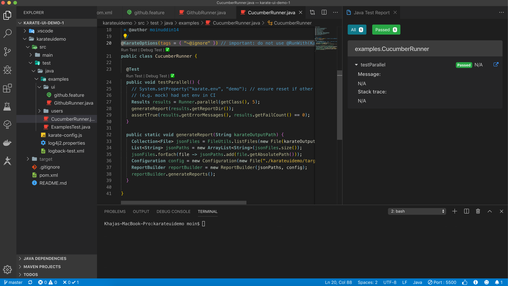

# karate-ui-demo-1

This is demo of UI Automation using Karate version 0.9.5RC3 on google.com and github.com

This project contains both Karate JUnit5 and Cucumber Runners. Also, can get Karate Surefire reports and/or Cucumber reports.

Successful run of CucumberRunner for Karate UI Automation

TODO:

1. At this moment, unable to run the CucumberRunner from command line.
2. Generate all kinds of reports only inside target folder only.
